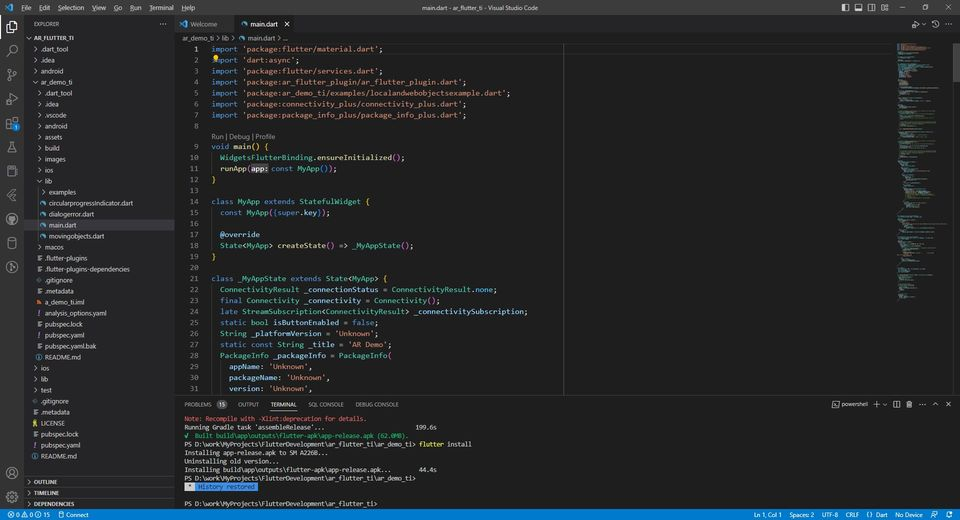
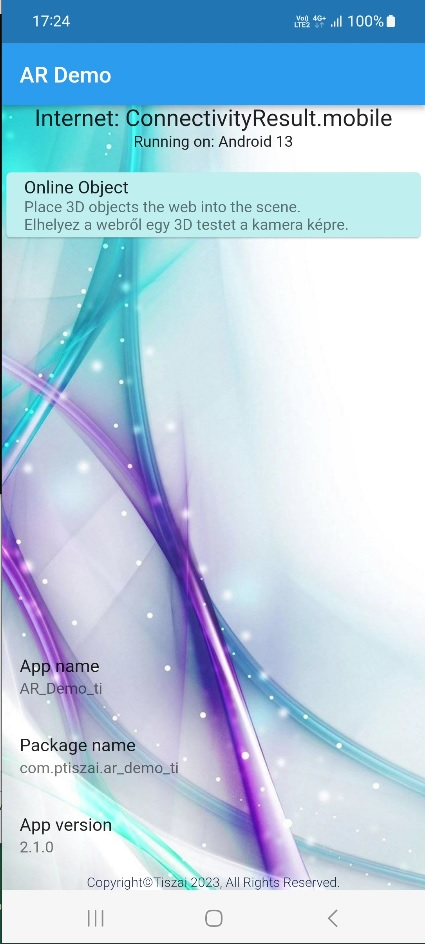
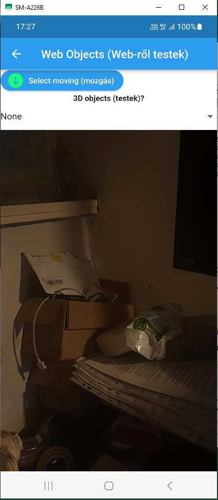
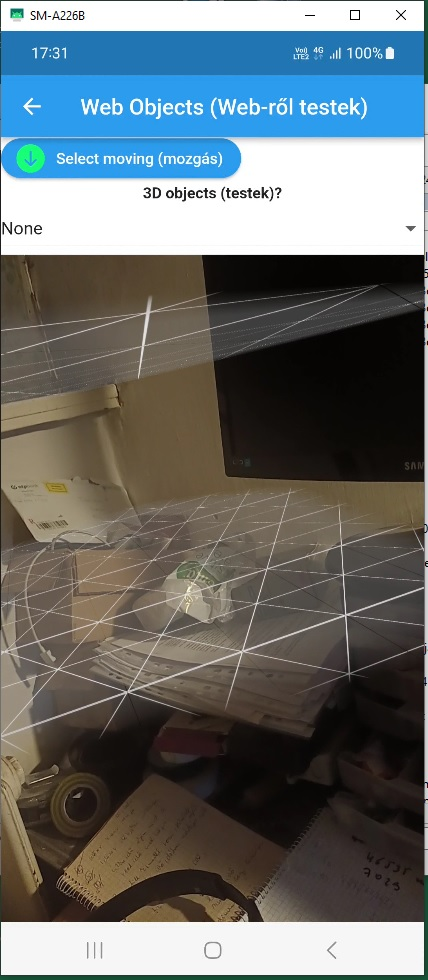
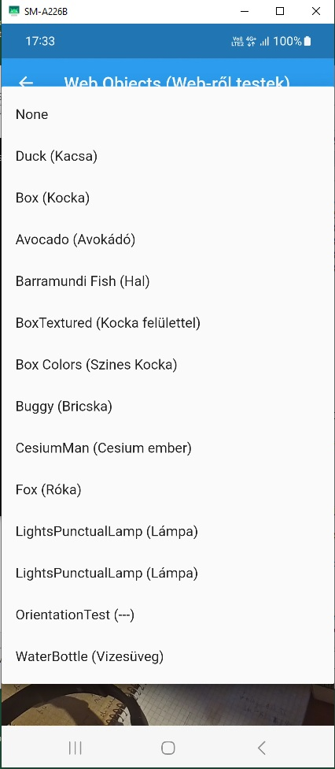
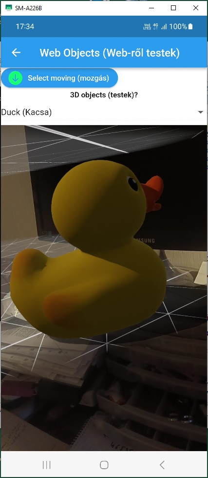
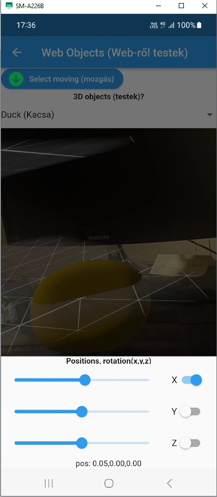

# ar_flutter_ti

## Augmented Reality (AR)
Flutter Plugin for (collaborative) Augmented Reality.<br>
Many thanks to Oleksandr Leuschenko and CariusLars for the 
[ar_flutter_plugin](https://github.com/CariusLars/ar_flutter_plugin).<br>

## Getting Started<br>
I probed only Android platform.<br>
The IDE 
[Visual Studio Code](https://code.visualstudio.com/).<br>

### Installing<br>
You created clone repository from ar_flutter_ti.<br>
Install Flutter, Dart extensions etc. in Visual Studio Code.<br>
IDE :
<div align="center">



</div><br>
<div align="center">

  +++   

</div><br>
Open Folder the ar_flutter_ti directory.<br>
You connected you android mobil. Android version is >= 9. <br>

Debug version is in temrinal windows:
```bash
cd ar_demo_ti
```
In Run menu "Start Debuging" or "Run Without Debugging". <br>
Release version is in temrinal windows: <br>

```bash
Flutter clean
flutter build apk
flutter install

// to the Google Play bundle file type
flutter build appbundle 
```

## App result images:<br>
<div align="center">




</div><br>
<div align="center">




</div><br>
<div align="center">




</div><br>
<br>
YouTube video (click):<br>
<div align="center">

[](https://www.youtube.com/watch?v=AvguI4dyZtY)

</div><br>
